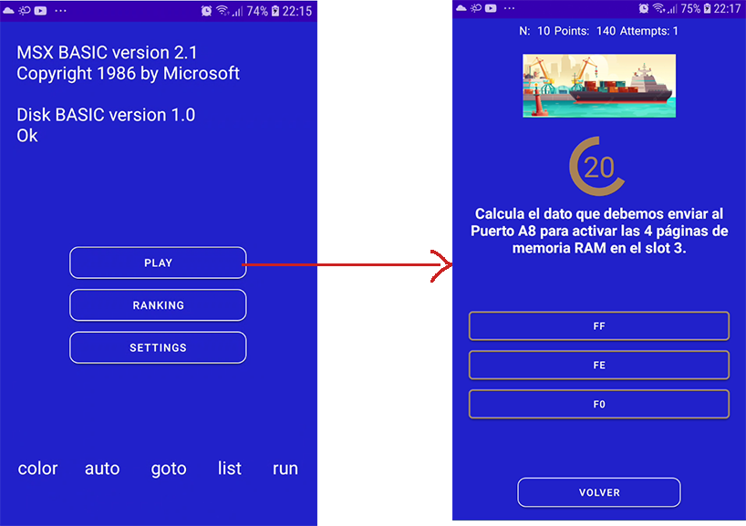
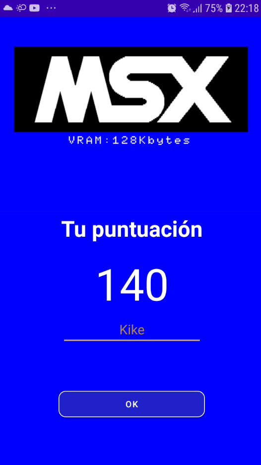
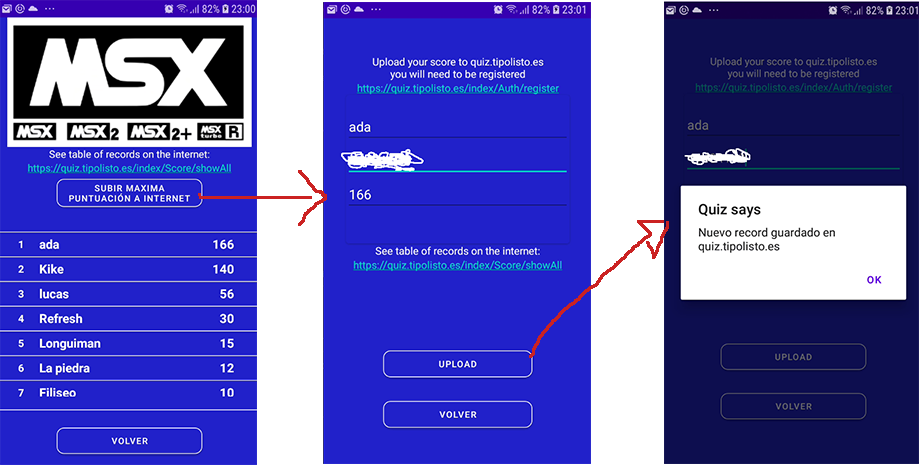
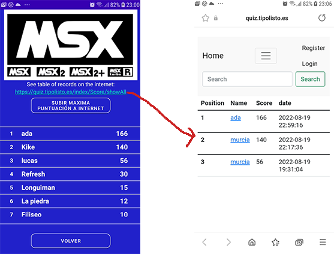

# Competición

MSX Quiz es una app para responder preguntas y competir en <a href="<?php echo PATHSERVER."Score/showAll" ?>">este raking</a>

<a href="https://play.google.com/store/apps/details?id=es.tipolisto.breeds">Descarga la app de aquí</a>

# Instrucciones

Una vez abierta pincha en Play y responde a las preguntas

Cuanto antes aciertes más puntos conseguirás, si has creado un nuevo record se te preguntará el nombre

Si pinchas en el menú principal en Ranking, verás tu puntuación maxima y la posibilidad de subirla a internet, en el siguiente ejemplo ada ha conseguido 166 puntos,
Al pinchar en "Subir máxima puntuación a internet" se te pedirá el usuario y contraseña

Una vez aprobado se quedará grabado en internet, puedes ver la tabla de records o ranking pinchando en el enlace que está encima del botón o  <a href="<?php echo PATHSERVER."Score/showAll"; ?>">aquí</a>

<h2>Sube tus propias preguntas</h2>

Si te registras en la web pinchando <a href="<?php echo PATHSERVER."Auth/register" ?>">Aquí</a>

Puedes crear nuevas preguntas pinchando en "New Quiz"

Para Gestionar tus preguntas pincha en "My Quizs"

El autor aparece en la parte baja:

# Desarrollo / Development

## Como Instalar

Está compuesto de 2 proyectos o módulos

1. Parte backend en php

    1.1 Deberás descomprimir el archivo php-pure/env-media.zip y colocar nel archivo env.php en app/config/env.php, las fotos en media/users/user186/*.*

    1.2 Abre el phpmyadmin y ejecuta el contenido del archivo sql/estructura bd.txt
2. Parte frontend en kotlin

    2.1 Pincha en abrir dentro de android studio

## Web desarrollo

https://developer.android.com/guide/topics/renderscript/compute?hl=es-419

## Librerias:

    Glide: para las fotos
    Room: para la base de datos
    Retrofit: para las peticiones REST
    CardView: para hacer bonita el scoreFragment
    Navigation: para navegar entre fragments
    Coorutinas: para las tareas en segundo plano
    Timber Countdown: reloj cuenta atrás

## Guia de arquitectura

Capa de UI X

Capa de dominio 

Capa de datos X

## Componentes de la arquitectura

### Bibliotecas de capas de UI

    Vinculación de vista - ViewBinding X

        Binding en activities X
        Binding en fragments X
        Binding en recyclerViews

### Bibliotecas de vinculación de datoa - dataBinding

### Componentes optimizados del cliclo de vida

    ViewModel X
    LiveData X
    Guardar estados de la UI
    Módulo de esado para ViewModel

Datastore	

Biblioteca de paginación	

WorkManager	
Coorutinas	
Componentes de navegación

Navigation drawer	
View pager
Intents y filtros de intents X

Interface de usuario

Diseños	

    MotionLayout para el movimiento de tu diseño	
    ConstraintLayout X	
    RecyclerView X	
    Linear layout X	
Apariencia y estilo	

    Estilos y temas	X
    Botones	X
    Casillas de verificación X	
    Selectores - switch (en fragmentSettings))	
Notificaciones	

Burbujas	

Barra de tu app	X (toolbar)

Dialogos X	

Menus X

Copiar y pegar	

Animaciones y transiciones

Imágenes y gráficos

Audio y video X, mediaPlayer

Servicios

Tareas en segundo plano

Permisos X

Archivos y datos de la aplicación room X

Identidad y datos del usuario

Ubicación del usuario

Camara

Sensores

Conectividad

RenderScript

App bundle

Google play
